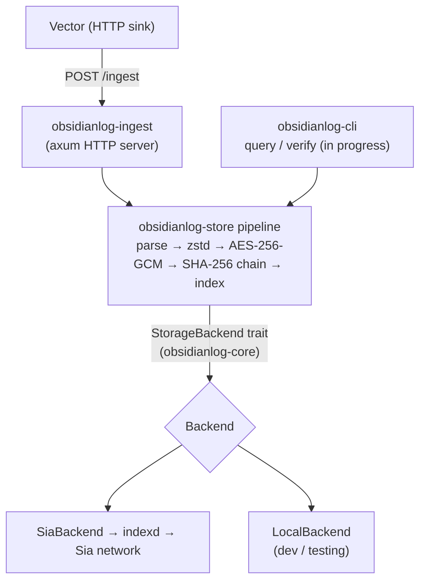

# ObsidianLog

[](https://github.com/emmaglorypraise/ObsidianLog/actions/workflows/ci.yml)

> Long-term, tamper-evident operational log archival on [Sia](https://sia.tech) — client-side encrypted, zstd-compressed, hash-chained, and queryable.

ObsidianLog sits alongside your hot observability stack (Datadog, Grafana, ELK) as a **cold-tier destination**. Logs flow into your active tools for monitoring, then archive to Sia: encrypted before they leave your infrastructure, compressed, hash-chained for tamper-evidence, and queryable at a fraction of the cost — with the keys and contracts owned entirely by you.

> **Status:** the storage pipeline and HTTP ingest server work and are tested end to end — logs come in, get compressed, encrypted, hash-chained, and indexed, and are retrievable and chain-verifiable. The `obsidianlog` CLI (`init` / `query` / `verify`) is in active development; see the [roadmap](#roadmap).

## Try it

Build from source (not yet published to crates.io):

```sh
cargo build --release
```

Run the Vector-compatible ingest server (defaults to `127.0.0.1:7080`):

```sh
./target/release/obsidianlog-ingest
```

Send it a batch and watch it get archived:

```sh
curl -s -X POST http://localhost:7080/ingest \
  -H 'content-type: application/json' \
  -d '[{"timestamp":"2026-07-06T10:00:00Z","service":"api","level":"info","msg":"hello"}]'
# 200 — acknowledged only after a durable, encrypted, hash-chained write
```

The chunk, its metadata index, and the manifest land under the storage root
(default `./obsidianlog-data`), in the same layout used on Sia. To ship real
logs, point Vector's HTTP sink at the same endpoint — see
[`crates/obsidianlog-ingest/examples/vector.toml`](crates/obsidianlog-ingest/examples/vector.toml).

> Retrieval and setup via the `obsidianlog` CLI (`query`, `verify`, `init`) are in
> progress — see the [roadmap](#roadmap).

## Architecture

Each log batch passes through a deterministic pipeline before it is stored:
**parse → group by time window → zstd compress → AES-256-GCM encrypt → SHA-256
hash-chain → index**. A lightweight metadata index (under 1% of log size) is
scanned first, so full chunks are fetched and decrypted only when they match.

Logs flow from Vector into the ingest server, through that pipeline, and out to a
pluggable backend. The `StorageBackend` trait (in `obsidianlog-core`) is the seam
that keeps storage decoupled from the pipeline.



- **Ingestion:** Vector posts JSON log batches to `obsidianlog-ingest` over HTTP.
- **Processing:** `obsidianlog-store` runs the pipeline and owns the crypto.
- **Storage:** ObsidianLog archives to **Sia** through the user's `indexd`, behind
  a pluggable `StorageBackend`; a local filesystem backend backs development and
  tests with the same on-storage layout.
- **Keys/secrets:** generated locally, stored in the OS keychain or a `0600`
  file — never transmitted, never committed.

## Repository layout

This is a Cargo workspace of four crates:

| Crate | Path | Role |
| --- | --- | --- |
| [`obsidianlog-core`](crates/obsidianlog-core) | foundation library | shared types, the canonical error, and the `StorageBackend` trait — no I/O |
| [`obsidianlog-store`](crates/obsidianlog-store) | core library | compression, encryption, hash chaining, chunking, metadata index, and the storage backends (Sia + local) |
| [`obsidianlog-ingest`](crates/obsidianlog-ingest) | service library | Vector-compatible HTTP ingest server that drives the storage pipeline |
| [`obsidianlog-cli`](crates/obsidianlog-cli) | CLI / binary | the `obsidianlog` binary: `init`, `ingest`, `query`, `verify` |

The `StorageBackend` trait (in `obsidianlog-core`) decouples the pipeline from
storage, so the same pipeline archives to Sia or to a local store (see
[`docs/adr`](docs/adr)).

## Development

```sh
cargo build --workspace          # build everything
cargo test  --workspace          # run unit + integration tests
cargo clippy --workspace --all-targets -- -D warnings
cargo fmt --all -- --check
```

Everything builds and tests with no external services. See
[CONTRIBUTING.md](CONTRIBUTING.md) for the full workflow and
[SECURITY.md](SECURITY.md) to report vulnerabilities.

## Roadmap

Grant milestones (task-by-task progress in
[`docs/grant/PROGRESS.md`](docs/grant/PROGRESS.md)):

- **Month 1 — Core Storage & Ingestion** (due 2026-07-25): `obsidianlog-store`
  and `obsidianlog-ingest`, integration tests + CI, finalized storage ADRs.
- **Month 2 — Query Tooling & Developer Experience** (due 2026-08-25): CLI query
  interface and `verify`, the `obsidianlog init` wizard, cross-platform binaries,
  Docker Compose quickstart.
- **Month 3 — Launch & Ecosystem Integration** (due 2026-09-25): reusable GitHub
  Actions workflow, documentation site, live demo, Grafana/SIEM integrations, and
  public launch.

## License

[MIT](LICENSE) © Glory Praise Emmanuel. The open-source core will remain MIT-licensed permanently.
