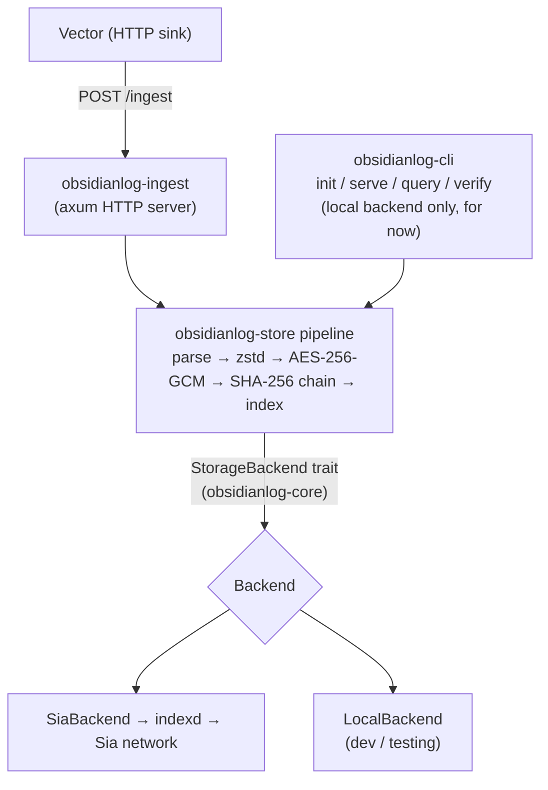

# ObsidianLog

[](https://github.com/emmaglorypraise/ObsidianLog/actions/workflows/ci.yml)

> Long-term, tamper-evident operational log archival on [Sia](https://sia.tech). Client-side encrypted, zstd-compressed, hash-chained, and queryable.

ObsidianLog sits alongside your hot observability stack (Datadog, Grafana, ELK) as a **cold-tier destination**. Logs flow into your active tools for monitoring, then archive to Sia: encrypted before they leave your infrastructure, compressed, hash-chained for tamper-evidence, and queryable at a fraction of the cost. You own the keys and the contracts, entirely.

> **Status:** the storage pipeline, HTTP ingest server, and `obsidianlog` CLI (`init`, `serve`, `query`, `verify`) all work and are tested end to end. Logs come in, get compressed, encrypted, hash-chained, and indexed, then come back out retrievable and chain-verifiable, including against real Sia (see [Testing the Sia backend](#testing-the-sia-backend)). A [Docker Compose quickstart](#docker-compose-quickstart) is available, and cross-platform release binaries (Linux/macOS/Windows) are published on tagged versions, see below.

## Try it

### Installing a release binary

Grab the archive for your platform from the
[Releases page](https://github.com/emmaglorypraise/ObsidianLog/releases). The
filename follows the pattern `obsidianlog-<version>-<target>.tar.gz` (`.zip`
on Windows), where `<target>` is one of `aarch64-apple-darwin`,
`x86_64-apple-darwin`, `aarch64-unknown-linux-musl`,
`x86_64-unknown-linux-musl`, or `x86_64-pc-windows-msvc`. Each archive
contains both binaries directly (no subfolder): `obsidianlog` (the CLI) and
`obsidianlog-ingest` (the standalone ingest server). No installer, no
dependencies.

For example, extracting v0.1.0 on Apple Silicon:

```sh
tar -xzf obsidianlog-v0.1.0-aarch64-apple-darwin.tar.gz
chmod +x obsidianlog obsidianlog-ingest   # the executable bit isn't always preserved in the archive
./obsidianlog init
```

Swap in whichever version and target you actually downloaded, matching the
exact filename from the Releases page or your Downloads folder.

Run these from an already-open terminal. `obsidianlog` is a command-line
tool, not a GUI app: double-clicking the binary (or the archive) in Finder
won't give you an interactive session to type into.

These ship **without** the `sia` Cargo feature (see the
[CLI section](#using-the-obsidianlog-cli) below); build from source instead
if you need that today. On macOS, Gatekeeper will flag the binary as
unsigned the first time. Right-click → Open once, or run
`xattr -d com.apple.quarantine obsidianlog` to clear it.

### Building from source

Not yet published to crates.io:

```sh
cargo build --release
```

Run the Vector-compatible ingest server (defaults to `127.0.0.1:7080`). The
standalone binary never reads its encryption key from the config file. It
refuses to start until you pass one via `OBSIDIANLOG_ENCRYPTION_KEY` (a
64-character hex string) or `OBSIDIANLOG_ENCRYPTION_KEY_FILE` (a path to a
file containing that string, the convention for a mounted Docker/Kubernetes
secret). For a quick local run:

```sh
OBSIDIANLOG_ENCRYPTION_KEY=$(openssl rand -hex 32) ./target/release/obsidianlog-ingest
```

(The `obsidianlog` CLI's `init`/`serve` below manage this key for you instead
of requiring the env var. See [Using the `obsidianlog` CLI](#using-the-obsidianlog-cli).)

Send it a batch and watch it get archived:

```sh
curl -s -X POST http://localhost:7080/ingest \
  -H 'content-type: application/json' \
  -d '[{"timestamp":"2026-07-06T10:00:00Z","service":"api","level":"info","msg":"hello"}]'
# 200: acknowledged only after a durable, encrypted, hash-chained write
```

The chunk, its metadata index, and the manifest land under the storage root
(default `./obsidianlog-data`), in the same layout used on Sia. To ship real
logs, point Vector's HTTP sink at the same endpoint. See
[`crates/obsidianlog-ingest/examples/vector.toml`](crates/obsidianlog-ingest/examples/vector.toml).

### Using the `obsidianlog` CLI

The CLI wraps setup, ingestion, retrieval, and integrity checking:

```sh
# One-time setup: generates the encryption key (OS keychain, or a 0600
# secrets file if the keychain isn't available) and writes config.toml.
# --non-interactive accepts defaults everywhere, useful for scripting.
obsidianlog init

# Run the ingest server using that config (equivalent to obsidianlog-ingest,
# but reads the key obsidianlog init created).
obsidianlog serve

# Query archived logs. Filters compose, and results are decrypted
# index-first (only matching chunks are fetched).
obsidianlog query --service api --level error --from 24h --format human

# Walk every service's hash chain from genesis and confirm it's intact.
# Exits non-zero on any break, so CI/cron can gate on it.
obsidianlog verify
```

Re-running `obsidianlog init` is idempotent: it detects an existing
config/key and reuses them. Pass `--force` to rotate the key (this makes
previously archived data undecryptable with the new key, so it asks for
confirmation unless you're also non-interactive).

**Note:** `serve`, `query`, and `verify` select their backend from
`config.indexd`: `LocalBackend` when unset, the real Sia backend when set
(see [ADR-0007](docs/adr/0007-indexer-topology.md)). The Sia backend needs
the `sia` Cargo feature. The prebuilt release binaries ship without it, so
Sia support means building it yourself:

```sh
cargo install --path crates/obsidianlog-cli --features sia
```

To exercise the real Sia path without the CLI at all, see
[Testing the Sia backend](#testing-the-sia-backend) below. It drives
`ArchiveEngine`/`SiaBackend` directly via `cargo test`.

### Testing the CLI end to end, locally

`init` prompts interactively unless you pass `--non-interactive` (which takes
every default below with no questions asked: the defaults are always the
local backend, never Sia):

1. `Storage bucket / namespace`: default `obsidianlog`.
2. `Storage backend`: `local` or `sia`; pick (or default to) **`local`** to
   stay off Sia entirely.
3. `Local storage directory`: default `./obsidianlog-data`.
4. `Ingest server bind address`: default `127.0.0.1:7080`.
5. `Chunk time window (seconds)`: default `3600`.

Full loop against a scratch location, so nothing touches your real config or
data directory:

```sh
cargo build -p obsidianlog-cli
rm -rf /tmp/obsidianlog-demo && mkdir -p /tmp/obsidianlog-demo

# 1. Set up: generates the key, writes config.toml. Add --non-interactive to
#    skip the prompts above (always picks local).
./target/debug/obsidianlog init --config /tmp/obsidianlog-demo/config.toml
cat /tmp/obsidianlog-demo/config.toml

# 2. Serve: start the ingest server, post a log batch, stop it.
./target/debug/obsidianlog serve --config /tmp/obsidianlog-demo/config.toml &
sleep 1
curl -s -X POST http://localhost:7080/ingest -H 'Content-Type: application/json' \
  -d '[{"timestamp":"2026-08-04T10:00:00Z","service":"api","level":"info","msg":"hello"}]'
kill %1

# 3. Query it back.
./target/debug/obsidianlog query --config /tmp/obsidianlog-demo/config.toml

# 4. Verify the hash chain.
./target/debug/obsidianlog verify --config /tmp/obsidianlog-demo/config.toml
```

`init` writes a real entry to your OS keychain (service `obsidianlog`,
account `encryption-key`). Clean up when you're done:

```sh
security delete-generic-password -s obsidianlog -a encryption-key   # macOS
# Linux: your Secret Service frontend (e.g. seahorse); Windows: Credential Manager
rm -rf /tmp/obsidianlog-demo
```

## Docker Compose quickstart

`docker/docker-compose.yml` runs the ingest server in a container against the
**local backend** by default. No Sia node, no wallet, nothing beyond Docker
itself. Real Sia storage via a self-hosted `indexd` is available too, but it
needs its own manual, one-time setup (a real wallet seed, at minimum) that
can't be scripted into `docker compose up`. See
[Optional: real Sia storage via indexd](#optional-real-sia-storage-via-indexd)
below.

### The local-backend path

```sh
# 1. Start the ingest server (builds the image on first run).
docker compose -f docker/docker-compose.yml up -d obsidianlog

# 2. One-time setup: generates the encryption key (stored inside the
#    container's persistent volume, not your host keychain) and config.toml
#    (written to ./docker/config, so you can inspect/edit it).
docker compose -f docker/docker-compose.yml run --rm obsidianlog \
  init --non-interactive --config /etc/obsidianlog/config.toml

# 3. Restart so the now-configured server picks up the generated key.
docker compose -f docker/docker-compose.yml restart obsidianlog

# 4. Send a test log.
curl -s -X POST http://localhost:7080/ingest \
  -H 'content-type: application/json' \
  -d '[{"timestamp":"2026-08-06T10:00:00Z","service":"api","level":"info","msg":"hello from docker"}]'

# 5. Query it back.
docker compose -f docker/docker-compose.yml run --rm obsidianlog \
  query --config /etc/obsidianlog/config.toml --service api

# 6. Verify the hash chain.
docker compose -f docker/docker-compose.yml run --rm obsidianlog \
  verify --config /etc/obsidianlog/config.toml
```

The encryption key and archived data live in the `obsidianlog-data` named
volume. They survive `docker compose restart`/`down` (without `-v`), so you
only run step 2 once. To ship real logs instead of the `curl` smoke test,
point Vector at the same endpoint. See
[`docker/vector.toml`](docker/vector.toml) (adapted from
[`crates/obsidianlog-ingest/examples/vector.toml`](crates/obsidianlog-ingest/examples/vector.toml)
for this setup).

### Optional: real Sia storage via `indexd`

The `sia` Compose profile adds `indexd` + the PostgreSQL database it requires,
matching indexd's own official example. It's off by default: `docker compose
up` alone never starts it.

```sh
cp docker/.env.example docker/.env    # set POSTGRES_PASSWORD
docker compose -f docker/docker-compose.yml --profile sia up -d
```

Before ObsidianLog can use it, `indexd` itself needs its own one-time setup.
This is indexd's own documented flow, not an ObsidianLog step:

```sh
docker compose -f docker/docker-compose.yml run --rm indexd seed
docker compose -f docker/docker-compose.yml run --rm -it indexd config
```

Then ObsidianLog needs an approved `AppKey` for that indexer. Run the
onboarding example from [Testing the Sia backend](#testing-the-sia-backend)
against `http://localhost:9982`, and set the resulting `indexd` section and
app key in `./docker/config/config.toml` (or re-run `obsidianlog init`
interactively and choose the Sia backend).

## Architecture

Each log batch passes through a deterministic pipeline before it is stored:
**parse → group by time window → zstd compress → AES-256-GCM encrypt → SHA-256
hash-chain → index**. A lightweight metadata index (under 1% of log size) is
scanned first, so full chunks are fetched and decrypted only when they match.

Logs flow from Vector into the ingest server, through that pipeline, and out to a
pluggable backend. The `StorageBackend` trait (in `obsidianlog-core`) is the seam
that keeps storage decoupled from the pipeline.



- **Ingestion:** Vector posts JSON log batches to `obsidianlog-ingest` over HTTP.
- **Processing:** `obsidianlog-store` runs the pipeline and owns the crypto.
- **Storage:** ObsidianLog archives to **Sia** through the user's `indexd`, behind
  a pluggable `StorageBackend`. A local filesystem backend backs development and
  tests with the same on-storage layout.
- **Keys/secrets:** generated locally, stored in the OS keychain or a `0600`
  file. Never transmitted, never committed.

## Repository layout

This is a Cargo workspace of four crates:

| Crate | Path | Role |
| --- | --- | --- |
| [`obsidianlog-core`](crates/obsidianlog-core) | foundation library | shared types, the canonical error, and the `StorageBackend` trait (no I/O) |
| [`obsidianlog-store`](crates/obsidianlog-store) | core library | compression, encryption, hash chaining, chunking, metadata index, and the storage backends (Sia + local) |
| [`obsidianlog-ingest`](crates/obsidianlog-ingest) | service library | Vector-compatible HTTP ingest server that drives the storage pipeline |
| [`obsidianlog-cli`](crates/obsidianlog-cli) | CLI / binary | the `obsidianlog` binary: `init`, `serve`, `query`, `verify` |

The `StorageBackend` trait (in `obsidianlog-core`) decouples the pipeline from
storage, so the same pipeline archives to Sia or to a local store (see
[`docs/adr`](docs/adr)).

## Development

```sh
cargo build --workspace          # build everything
cargo test  --workspace          # run unit + integration tests
cargo clippy --workspace --all-targets -- -D warnings
cargo fmt --all -- --check
```

Everything builds and tests with no external services. See
[CONTRIBUTING.md](CONTRIBUTING.md) for the full workflow and
[SECURITY.md](SECURITY.md) to report vulnerabilities.

## Testing the Sia backend

By default everything runs against the local backend. No Sia node required. To
verify the real Sia path end to end, point the `sia`-feature integration test at
an indexer; the hosted [`sia.storage`](https://sia.storage) (50 GB free tier) is
the quickest.

1. **Onboard**: derive an `AppKey` from your Sia recovery phrase (read from
   stdin; never stored, logged, or transmitted):

   ```sh
   cargo run -p obsidianlog-store --features sia --example onboard
   ```

   Open the printed approval URL, approve the app, and copy the 64-hex `AppKey`.

2. **Run the end-to-end test:**

   ```sh
   export OBSIDIANLOG_INDEXD_URL=https://sia.storage
   export OBSIDIANLOG_APP_KEY=<your-64-hex-key>
   cargo test -p obsidianlog-store --features sia --test sia -- --nocapture
   ```

   It ingests records, uploads to Sia, reads them back, and verifies the hash
   chain. Without the env vars the test skips cleanly, so CI stays Sia-free.

## Roadmap

Grant milestones (task-by-task progress in
[`docs/grant/PROGRESS.md`](docs/grant/PROGRESS.md)):

- **Month 1: Core Storage & Ingestion** (due 2026-07-25): `obsidianlog-store`
  and `obsidianlog-ingest`, integration tests + CI, finalized storage ADRs.
- **Month 2: Query Tooling & Developer Experience** (due 2026-08-25): CLI query
  interface, `verify`, the `obsidianlog init` wizard, the Docker Compose
  quickstart, and cross-platform release binaries. **Done.**
- **Month 3: Launch & Ecosystem Integration** (due 2026-09-25): reusable GitHub
  Actions workflow, documentation site, live demo, Grafana/SIEM integrations, and
  public launch.

## License

[MIT](LICENSE) © Glory Praise Emmanuel. The open-source core will remain MIT-licensed permanently.
