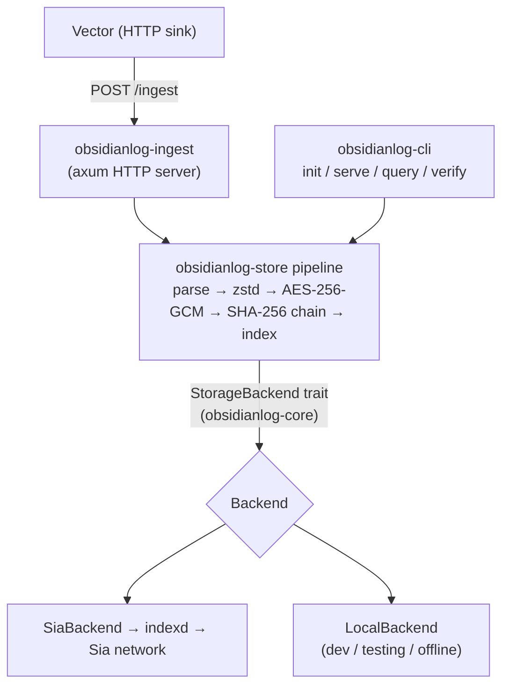

Each log batch passes through a deterministic pipeline before it is stored:
**parse → group by time window → zstd compress → AES-256-GCM encrypt →
SHA-256 hash-chain → index**. A lightweight metadata index (under 1% of log
size) is scanned first, so full chunks are fetched and decrypted only when
they match a query.

Logs flow from Vector into the ingest server, through that pipeline, and out
to a pluggable backend. The `StorageBackend` trait (in `obsidianlog-core`) is
the seam that keeps storage decoupled from the pipeline. The same pipeline
archives to Sia (hosted or self-hosted) or to a local filesystem store with
no other code change.

- **Ingestion:** Vector posts JSON log batches to `obsidianlog-ingest` over
  HTTP.
- **Processing:** `obsidianlog-store` runs the pipeline and owns the crypto.
- **Storage:** ObsidianLog archives to **Sia** through an `indexd` instance
  (hosted or self-hosted), behind a pluggable `StorageBackend`. A local
  filesystem backend backs development and tests with the same on-storage
  layout.
- **Keys/secrets:** generated locally and stored in the OS keychain or a
  `0600` file. They are never transmitted and never committed.

## Getting your logs back

Sia storage, through `indexd`, is content-addressed: there's no "fetch the
file at this path" operation the way there is on a normal filesystem or
S3. Objects are found by hash, not by name. `obsidianlog query` still
works like a normal query tool on top of that, using two ideas:

- **Every object carries its own map.** When a chunk is uploaded, its
  logical path (`<bucket>/chunks/<service>/<window>-<sequence>.bin`) and,
  for chunk objects, that window's lightweight index both ride along in
  the object's own metadata field. Metadata is cheap to read without
  downloading the much larger encrypted body next to it.
- **Queries narrow before they ever download a body.** `query` reads a
  small manifest to find candidate chunks by service and time range,
  fetches only their metadata indexes (not their bodies) to prefilter
  against your actual query, and only downloads and decrypts the bodies
  of chunks that survive that prefilter.

Most of a query's cost is scanning small indexes, not moving encrypted
log data around, which is what keeps `obsidianlog query` practical even
against a large archive. See
[ADR-0008](https://github.com/emmaglorypraise/ObsidianLog/blob/main/docs/adr/0008-sia-object-overhead.md)
for the full reasoning.

## Repository layout

This is a Cargo workspace of four crates:

| Crate | Role |
| --- | --- |
| `obsidianlog-core` | Foundation library: shared types, the canonical error, and the `StorageBackend` trait (no I/O). |
| `obsidianlog-store` | Core library: compression, encryption, hash chaining, chunking, metadata index, and the storage backends (Sia + local). |
| `obsidianlog-ingest` | Service library: the Vector-compatible HTTP ingest server that drives the storage pipeline. |
| `obsidianlog-cli` | CLI / binary: the `obsidianlog` binary, with `init`, `serve`, `query`, `verify`. |

See [Decisions](/architecture-and-security/decisions) for the reasoning
behind this layout (ADR-0004) and the storage data model (ADR-0005).
