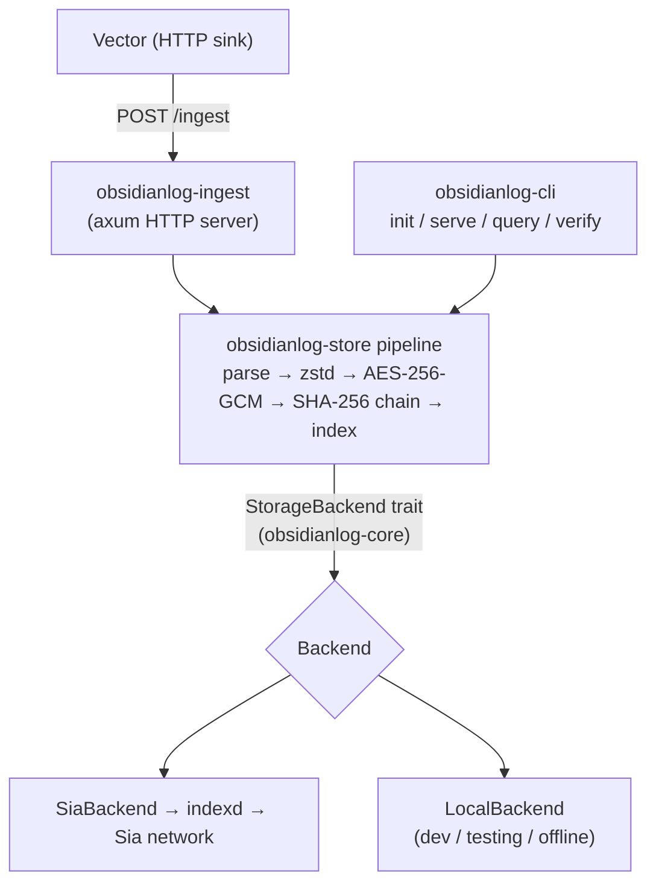

Each log batch passes through a deterministic pipeline before it is stored:
**parse → group by time window → zstd compress → AES-256-GCM encrypt →
SHA-256 hash-chain → index**. A lightweight metadata index (under 1% of log
size) is scanned first, so full chunks are fetched and decrypted only when
they match a query.

Logs flow from Vector into the ingest server, through that pipeline, and out
to a pluggable backend. The `StorageBackend` trait (in `obsidianlog-core`) is
the seam that keeps storage decoupled from the pipeline — the same pipeline
archives to Sia (hosted or self-hosted) or to a local filesystem store with
no other code change.

- **Ingestion:** Vector posts JSON log batches to `obsidianlog-ingest` over
  HTTP.
- **Processing:** `obsidianlog-store` runs the pipeline and owns the crypto.
- **Storage:** ObsidianLog archives to **Sia** through an `indexd` instance
  (hosted or self-hosted), behind a pluggable `StorageBackend`. A local
  filesystem backend backs development and tests with the same on-storage
  layout.
- **Keys/secrets:** generated locally, stored in the OS keychain or a `0600`
  file. Never transmitted, never committed.

## Repository layout

This is a Cargo workspace of four crates:

| Crate | Role |
| --- | --- |
| `obsidianlog-core` | Foundation library — shared types, the canonical error, and the `StorageBackend` trait (no I/O). |
| `obsidianlog-store` | Core library — compression, encryption, hash chaining, chunking, metadata index, and the storage backends (Sia + local). |
| `obsidianlog-ingest` | Service library — the Vector-compatible HTTP ingest server that drives the storage pipeline. |
| `obsidianlog-cli` | CLI / binary — the `obsidianlog` binary: `init`, `serve`, `query`, `verify`. |

See [Decisions](/architecture-and-security/decisions) for the reasoning
behind this layout (ADR-0004) and the storage data model (ADR-0005).
